# CloudJobHunt - Architecture Complète et Plan de Mise en Œuvre

## 📋 Table des Matières

1. [Vue d'Ensemble](#vue-densemble)
2. [Architecture Système](#architecture-système)
3. [Modèles de Données PostgreSQL](#modèles-de-données-postgresql)
4. [API FastAPI - Endpoints](#api-fastapi---endpoints)
5. [Système de Scraping](#système-de-scraping)
6. [Matching Intelligent](#matching-intelligent)
7. [Configuration Kubernetes](#configuration-kubernetes)
8. [CI/CD Pipeline](#cicd-pipeline)
9. [Plan de Mise en Œuvre](#plan-de-mise-en-œuvre)

---

## 1. Vue d'Ensemble

### 1.1 Description du Projet

CloudJobHunt est une application web de recherche d'emplois avec scraping intelligent qui récupère des offres depuis LinkedIn et autres plateformes pour les utilisateurs de la Tunisie, France, Allemagne, Belgique et UK.

### 1.2 Objectifs

- 🤖 Scraping automatisé des offres d'emploi
- 🧠 Matching intelligent CV/offres
- 🔔 Notifications personnalisées
- 📊 Dashboard utilisateur complet
- 🚀 Déploiement scalable sur Kubernetes

### 1.3 Technologies

| Composant | Technologie |
|-----------|-------------|
| Backend | FastAPI + SQLAlchemy + Pydantic |
| Base de données | PostgreSQL Flexible Server (Azure) |
| Scraping | Playwright + httpx + BeautifulSoup |
| Frontend | Jinja2 Templates ou React SPA |
| Conteneurisation | Docker |
| Orchestration | Azure Kubernetes Service |
| CI/CD | Jenkins |
| Monitoring | Grafana + Azure Monitor |
| Sécurité | Let's Encrypt + Azure Key Vault |

---

## 2. Architecture Système

### 2.1 Diagramme d'Architecture Global

```mermaid
flowchart TB
    subgraph Internet
        User[👤 Utilisateur]
        LinkedIn[📋 LinkedIn]
        Indeed[📋 Indeed]
        WTTJ[📋 Welcome to the Jungle]
    end

    subgraph Azure["🌐 Azure Cloud"]
        subgraph AKS["🛡️ AKS Cluster"]
            Backend[⚡ Backend FastAPI]
            Scheduler[⏰ Scheduler]
            Worker[👷 Worker Scraping]
        end
        
        subgraph PostgreSQL["🗄️ PostgreSQL Flexible"]
            DB[(📦 cloudjobhunt DB)]
        end
        
        subgraph ACR["📦 Azure Container Registry"]
            Images[�Dockers Images]
        end
        
        subgraph Monitoring["📊 Monitoring"]
            Grafana[📈 Grafana]
            AlertManager[🔔 AlertManager]
        end
    end

    User -->|HTTPS| Backend
    Backend -->|Read/Write| DB
    Worker -->|Scraping| LinkedIn
    Worker -->|Scraping| Indeed
    Worker -->|Scraping| WTTJ
    Scheduler -->|Trigger| Worker
    Backend -->|Metrics| Grafana
    Grafana -->|Alerts| AlertManager
```



### 2.2 Architecture des Composants

```mermaid
flowchart LR
    subgraph Frontend
        UI[🌐 Web Interface]
    end

    subgraph API["API Gateway / FastAPI"]
        Auth[🔐 Auth]
        Jobs[💼 Jobs]
        Users[👤 Users]
        Matching[🧠 Matching]
        Notifications[🔔 Notifications]
    end

    subgraph Services["Services Métier"]
        Scraping["🕷️ Scraping Service"]
        CVParser["📄 CV Parser"]
        Matcher["🔍 Matching Engine"]
        Notifier["📧 Notification Service"]
    end

    subgraph Data["📦 Données"]
        PostgreSQL[(PostgreSQL)]
        Cache[(Redis - Optionnel)]
    end

    UI --> API
    API --> Services
    Services --> Data
```



### 2.3 Flux de Données

```mermaid
sequenceDiagram
    participant U as 👤 Utilisateur
    participant A as ⚡ API
    participant S as 🕷️ Scraper
    participant M as 🧠 Matcher
    participant D as 🗄️ DB
    participant N as 🔔 Notifier

    U->>A: Recherche avec critères
    A->>D: Vérifier cache jobs
    alt Jobs en cache
        D->>A: Retourner jobs
    else Nécessite scraping
        A->>S: Requête scraping
        S->>LinkedIn: Scraping offres
        S->>Indeed: Scraping offres
        LinkedIn-->>S: Données offres
        Indeed-->>S: Données offres
        S->>S: Normaliser données
        S->>D: Sauvegarder jobs
        S->>M: Envoyer pour matching
        M->>D: Récupérer CV utilisateur
        M->>M: Calculer scores matching
        M->>D: Sauvegarder scores
        D->>A: Retourner jobs triés
    end
    A->>U: Afficher résultats
```



---

## 3. Modèles de Données PostgreSQL

### 3.1 Schéma Global


### 3.2 Définition SQL Détaillée

```sql
-- ============================================
-- ENUMS & TYPES
-- ============================================

CREATE TYPE contract_type AS ENUM (
    'full_time',
    'part_time',
    'contract',
    'internship',
    'freelance',
    'temporary'
);

CREATE TYPEUM (
    ' experience_level AS ENentry',
    'junior',
    'mid',
    'senior',
    'lead',
    'executive'
);

CREATE TYPE application_status AS ENUM (
    'saved',
    'applied',
    'interview',
    'offer',
    'rejected',
    'withdrawn'
);

CREATE TYPE job_source AS ENUM (
    'linkedin',
    'indeed',
    'wttj',
    'monster',
    'jobteaser',
    'other'
);

-- ============================================
-- TABLES PRINCIPALES
-- ============================================

-- Utilisateurs
CREATE TABLE users (
    id UUID PRIMARY KEY DEFAULT gen_random_uuid(),
    email VARCHAR(255) UNIQUE NOT NULL,
    password_hash VARCHAR(255) NOT NULL,
    first_name VARCHAR(100),
    last_name VARCHAR(100),
    phone VARCHAR(20),
    profile_image_url TEXT,
    timezone VARCHAR(50) DEFAULT 'UTC',
    email_notifications BOOLEAN DEFAULT true,
    push_notifications BOOLEAN DEFAULT false,
    is_active BOOLEAN DEFAULT true,
    created_at TIMESTAMP WITH TIME ZONE DEFAULT NOW(),
    updated_at TIMESTAMP WITH TIME ZONE DEFAULT NOW()
);

-- Index utilisateurs
CREATE INDEX idx_users_email ON users(email);
CREATE INDEX idx_users_created_at ON users(created_at);

-- Offres d'emploi
CREATE TABLE jobs (
    id UUID PRIMARY KEY DEFAULT gen_random_uuid(),
    external_id VARCHAR(255) UNIQUE NOT NULL,
    source job_source NOT NULL,
    title VARCHAR(255) NOT NULL,
    company VARCHAR(255) NOT NULL,
    description TEXT,
    location VARCHAR(255),
    country VARCHAR(100) NOT NULL,
    city VARCHAR(100),
    contract_type contract_type,
    experience_level experience_level,
    salary_min DECIMAL(12, 2),
    salary_max DECIMAL(12, 2),
    salary_currency VARCHAR(3) DEFAULT 'EUR',
    job_url TEXT NOT NULL,
    application_url TEXT,
    company_logo_url TEXT,
    company_size VARCHAR(50),
    company_industry VARCHAR(100),
    remote_policy VARCHAR(50),
    published_at TIMESTAMP WITH TIME ZONE,
    expires_at TIMESTAMP WITH TIME ZONE,
    scraped_at TIMESTAMP WITH TIME ZONE DEFAULT NOW(),
    is_active BOOLEAN DEFAULT true,
    view_count INTEGER DEFAULT 0,
    apply_count INTEGER DEFAULT 0,
    raw_data JSONB,
    created_at TIMESTAMP WITH TIME ZONE DEFAULT NOW(),
    updated_at TIMESTAMP WITH TIME ZONE DEFAULT NOW()
);

-- Index offres
CREATE INDEX idx_jobs_source ON jobs(source);
CREATE INDEX idx_jobs_country ON jobs(country);
CREATE INDEX idx_jobs_contract_type ON jobs(contract_type);
CREATE INDEX idx_jobs_published_at ON jobs(published_at DESC);
CREATE INDEX idx_jobs_created_at ON jobs(created_at DESC);
CREATE INDEX idx_jobs_title ON jobs(title);
CREATE INDEX idx_jobs_company ON jobs(company);
CREATE INDEX idx_jobs_location ON jobs(location);

-- Compuestos
CREATE INDEX idx_jobs_country_contract ON jobs(country, contract_type);
CREATE INDEX idx_jobs_country_salary ON jobs(country, salary_min);

-- CV Utilisateurs
CREATE TABLE cv (
    id UUID PRIMARY KEY DEFAULT gen_random_uuid(),
    user_id UUID NOT NULL REFERENCES users(id) ON DELETE CASCADE,
    file_name VARCHAR(255) NOT NULL,
    file_path TEXT NOT NULL,
    file_size_bytes INTEGER,
    content_type VARCHAR(100),
    parsed_data JSONB,
    extracted_skills TEXT[],
    total_experience_years NUMERIC(4, 1),
    education_level VARCHAR(100),
    desired_job_titles TEXT[],
    desired_locations TEXT[],
    desired_contract_types TEXT[],
    salary_expectation_min DECIMAL(12, 2),
    salary_expectation_max DECIMAL(12, 2),
    summary TEXT,
    is_primary BOOLEAN DEFAULT false,
    uploaded_at TIMESTAMP WITH TIME ZONE DEFAULT NOW(),
    updated_at TIMESTAMP WITH TIME ZONE DEFAULT NOW()
);

-- Index CV
CREATE INDEX idx_cv_user_id ON cv(user_id);
CREATE INDEX idx_cv_primary ON cv(user_id, is_primary) WHERE is_primary = true;

-- Préférences de recherche
CREATE TABLE search_preferences (
    id UUID PRIMARY KEY DEFAULT gen_random_uuid(),
    user_id UUID NOT NULL REFERENCES users(id) ON DELETE CASCADE,
    name VARCHAR(100) NOT NULL,
    keywords TEXT[],
    countries TEXT[],
    cities TEXT[],
    contract_types TEXT[],
    experience_levels TEXT[],
    salary_min DECIMAL(12, 2),
    salary_max DECIMAL(12, 2),
    remote_policy TEXT[],
    company_industries TEXT[],
    company_sizes TEXT[],
    skills TEXT[],
    is_active BOOLEAN DEFAULT true,
    created_at TIMESTAMP WITH TIME ZONE DEFAULT NOW(),
    updated_at TIMESTAMP WITH TIME ZONE DEFAULT NOW()
);

-- Index préférences
CREATE INDEX idx_search_prefs_user_id ON search_preferences(user_id);

-- Jobs sauvegardés
CREATE TABLE saved_jobs (
    id UUID PRIMARY KEY DEFAULT gen_random_uuid(),
    user_id UUID NOT NULL REFERENCES users(id) ON DELETE CASCADE,
    job_id UUID NOT NULL REFERENCES jobs(id) ON DELETE CASCADE,
    notes TEXT,
    is_favorite BOOLEAN DEFAULT false,
    saved_at TIMESTAMP WITH TIME ZONE DEFAULT NOW(),
    UNIQUE(user_id, job_id)
);

-- Index jobs sauvegardés
CREATE INDEX idx_saved_jobs_user_id ON saved_jobs(user_id);
CREATE INDEX idx_saved_jobs_job_id ON saved_jobs(job_id);

-- Historique de recherche
CREATE TABLE search_history (
    id UUID PRIMARY KEY DEFAULT gen_random_uuid(),
    user_id UUID NOT NULL REFERENCES users(id) ON DELETE CASCADE,
    query_text TEXT,
    filters JSONB,
    results_count INTEGER,
    ip_address INET,
    user_agent TEXT,
    created_at TIMESTAMP WITH TIME ZONE DEFAULT NOW()
);

-- Index historique
CREATE INDEX idx_search_history_user_id ON search_history(user_id);
CREATE INDEX idx_search_history_created_at ON search_history(created_at DESC);

-- Candidatures
CREATE TABLE applications (
    id UUID PRIMARY KEY DEFAULT gen_random_uuid(),
    user_id UUID NOT NULL REFERENCES users(id) ON DELETE CASCADE,
    job_id UUID NOT NULL REFERENCES jobs(id) ON DELETE CASCADE,
    cv_id UUID REFERENCES cv(id),
    status application_status DEFAULT 'applied',
    cover_letter TEXT,
    applied_at TIMESTAMP WITH TIME ZONE DEFAULT NOW(),
    updated_at TIMESTAMP WITH TIME ZONE DEFAULT NOW(),
    notes TEXT,
    UNIQUE(user_id, job_id)
);

-- Index candidatures
CREATE INDEX idx_applications_user_id ON applications(user_id);
CREATE INDEX idx_applications_job_id ON applications(job_id);
CREATE INDEX idx_applications_status ON applications(status);

-- Résultats de matching
CREATE TABLE job_matches (
    id UUID PRIMARY KEY DEFAULT gen_random_uuid(),
    user_id UUID NOT NULL REFERENCES users(id) ON DELETE CASCADE,
    job_id UUID NOT NULL REFERENCES jobs(id) ON DELETE CASCADE,
    cv_id UUID REFERENCES cv(id),
    match_score DECIMAL(5, 2) NOT NULL,
    skills_match JSONB,
    experience_match DECIMAL(5, 2),
    location_match DECIMAL(5, 2),
    salary_match DECIMAL(5, 2),
    matched_skills TEXT[],
    missing_skills TEXT[],
    match_reasons TEXT[],
    calculated_at TIMESTAMP WITH TIME ZONE DEFAULT NOW(),
    UNIQUE(user_id, job_id, cv_id)
);

-- Index matching
CREATE INDEX idx_job_matches_user_id ON job_matches(user_id);
CREATE INDEX idx_job_matches_job_id ON job_matches(job_id);
CREATE INDEX idx_job_matches_score ON job_matches(match_score DESC);

-- Alertes jobs
CREATE TABLE job_alerts (
    id UUID PRIMARY KEY DEFAULT gen_random_uuid(),
    user_id UUID NOT NULL REFERENCES users(id) ON DELETE CASCADE,
    search_preference_id UUID REFERENCES search_preferences(id),
    name VARCHAR(100) NOT NULL,
    is_active BOOLEAN DEFAULT true,
    frequency VARCHAR(20) DEFAULT 'daily',
    last_sent_at TIMESTAMP WITH TIME ZONE,
    next_send_at TIMESTAMP WITH TIME ZONE,
    created_at TIMESTAMP WITH TIME ZONE DEFAULT NOW(),
    updated_at TIMESTAMP WITH TIME ZONE DEFAULT NOW()
);

-- Index alertes
CREATE INDEX idx_job_alerts_user_id ON job_alerts(user_id);
CREATE INDEX idx_job_alerts_next_send ON job_alerts(next_send_at) WHERE is_active = true;

-- Jobs matched pour alertes
CREATE TABLE matching_jobs (
    id UUID PRIMARY KEY DEFAULT gen_random_uuid(),
    job_alert_id UUID NOT NULL REFERENCES job_alerts(id) ON DELETE CASCADE,
    job_id UUID NOT NULL REFERENCES jobs(id) ON DELETE CASCADE,
    match_score DECIMAL(5, 2) NOT NULL,
    sent BOOLEAN DEFAULT false,
    sent_at TIMESTAMP WITH TIME ZONE,
    created_at TIMESTAMP WITH TIME ZONE DEFAULT NOW(),
    UNIQUE(job_alert_id, job_id)
);

-- Index matching_jobs
CREATE INDEX idx_matching_jobs_alert_id ON matching_jobs(job_alert_id);
CREATE INDEX idx_matching_jobs_sent ON matching_jobs(sent) WHERE sent = false;

-- Logs de scraping
CREATE TABLE scraping_logs (
    id UUID PRIMARY KEY DEFAULT gen_random_uuid(),
    source job_source NOT NULL,
    status VARCHAR(20) NOT NULL,
    jobs_found INTEGER DEFAULT 0,
    jobs_new INTEGER DEFAULT 0,
    jobs_updated INTEGER DEFAULT 0,
    duration_seconds INTEGER,
    error_message TEXT,
    started_at TIMESTAMP WITH TIME ZONE DEFAULT NOW(),
    completed_at TIMESTAMP WITH TIME ZONE
);

-- Index logs
CREATE INDEX idx_scraping_logs_source ON scraping_logs(source);
CREATE INDEX idx_scraping_logs_started_at ON scraping_logs(started_at DESC);

-- ============================================
-- VUES
-- ============================================

-- Vue jobs actifs par pays
CREATE VIEW active_jobs_by_country AS
SELECT 
    country,
    COUNT(*) as total_jobs,
    COUNT(DISTINCT company) as total_companies
FROM jobs
WHERE is_active = true AND published_at > NOW() - INTERVAL '30 days'
GROUP BY country;

-- Vue statistiques utilisateur
CREATE VIEW user_stats AS
SELECT 
    u.id,
    u.email,
    COUNT(DISTINCT s.id) as saved_jobs_count,
    COUNT(DISTINCT a.id) as applications_count,
    COUNT(DISTINCT c.id) as cv_count,
    COUNT(DISTINCT sp.id) as search_prefs_count,
    MAX(s.created_at) as last_activity
FROM users u
LEFT JOIN saved_jobs s ON s.user_id = u.id
LEFT JOIN applications a ON a.user_id = u.id
LEFT JOIN cv c ON c.user_id = u.id
LEFT JOIN search_preferences sp ON sp.user_id = u.id
GROUP BY u.id;

-- ============================================
-- FONCTIONS
-- ============================================

-- Mise à jour automatique timestamp
CREATE OR REPLACE FUNCTION update_updated_at()
RETURNS TRIGGER AS $$
BEGIN
    NEW.updated_at = NOW();
    RETURN NEW;
END;
$$ LANGUAGE plpgsql;

-- Triggers pour updated_at
CREATE TRIGGER update_users_updated_at BEFORE UPDATE ON users
    FOR EACH ROW EXECUTE FUNCTION update_updated_at();

CREATE TRIGGER update_jobs_updated_at BEFORE UPDATE ON jobs
    FOR EACH ROW EXECUTE FUNCTION update_updated_at();

CREATE TRIGGER update_cv_updated_at BEFORE UPDATE ON cv
    FOR EACH ROW EXECUTE FUNCTION update_updated_at();

CREATE TRIGGER update_applications_updated_at BEFORE UPDATE ON applications
    FOR EACH ROW EXECUTE FUNCTION update_updated_at();

-- Fonction recherche jobs
CREATE OR REPLACE FUNCTION search_jobs(
    p_keywords TEXT[],
    p_countries TEXT[],
    p_contract_types TEXT[],
    p_experience_levels TEXT[],
    p_salary_min DECIMAL,
    p_salary_max DECIMAL,
    p_limit INTEGER DEFAULT 50,
    p_offset INTEGER DEFAULT 0
) RETURNS TABLE (
    job_id UUID,
    title TEXT,
    company TEXT,
    location TEXT,
    country TEXT,
    contract_type TEXT,
    salary_min DECIMAL,
    salary_max DECIMAL,
    published_at TIMESTAMP WITH TIME ZONE,
    match_score DECIMAL
) AS $$
BEGIN
    RETURN QUERY
    SELECT 
        j.id,
        j.title,
        j.company,
        j.location,
        j.country,
        j.contract_type::TEXT,
        j.salary_min,
        j.salary_max,
        j.published_at,
        NULL::DECIMAL as match_score
    FROM jobs j
    WHERE j.is_active = true
        AND (p_countries IS NULL OR j.country = ANY(p_countries))
        AND (p_contract_types IS NULL OR j.contract_type::TEXT = ANY(p_contract_types))
        AND (p_experience_levels IS NULL OR j.experience_level::TEXT = ANY(p_experience_levels))
        AND (p_salary_min IS NULL OR j.salary_min >= p_salary_min)
        AND (p_salary_max IS NULL OR j.salary_max <= p_salary_max)
        AND (p_keywords IS NULL OR 
            j.title ILIKE ANY(ARRAY(SELECT '%' || kw || '%' FROM unnest(p_keywords) kw))
            OR j.description ILIKE ANY(ARRAY(SELECT '%' || kw || '%' FROM unnest(p_keywords) kw))
        )
    ORDER BY j.published_at DESC
    LIMIT p_limit OFFSET p_offset;
END;
$$ LANGUAGE plpgsql SECURITY DEFINER;
```

---

## 4. API FastAPI - Endpoints

### 4.1 Structure des Routes

```
/api/v1
├── /auth
│   ├── POST /register
│   ├── POST /login
│   ├── POST /logout
│   ├── POST /refresh
│   ├── GET /me
│   ├── PUT /me
│   └── POST /change-password
│
├── /users
│   ├── GET /profile
│   ├── PUT /profile
│   ├── DELETE /account
│   └── GET /stats
│
├── /jobs
│   ├── GET / (search)
│   ├── GET /{job_id}
│   ├── GET /{job_id}/similar
│   ├── GET /suggestions
│   └── GET /trending
│
├── /saved-jobs
│   ├── GET /
│   ├── POST /{job_id}
│   ├── DELETE /{job_id}
│   ├── GET /favorites
│   └── PUT /{job_id}/notes
│
├── /applications
│   ├── GET /
│   ├── POST /{job_id}
│   ├── GET /{application_id}
│   ├── PUT /{application_id}
│   ├── PUT /{application_id}/status
│   └── DELETE /{application_id}
│
├── /cv
│   ├── GET /
│   ├── POST /upload
│   ├── GET /{cv_id}
│   ├── DELETE /{cv_id}
│   ├── PUT /{cv_id}
│   ├── GET /{cv_id}/parse
│   └── POST /{cv_id}/primary
│
├── /search-preferences
│   ├── GET /
│   ├── POST /
│   ├── GET /{pref_id}
│   ├── PUT /{pref_id}
│   ├── DELETE /{pref_id}
│   └── POST /{pref_id}/activate
│
├── /matching
│   ├── GET /jobs (recommendations)
│   ├── GET /jobs/{job_id}/score
│   ├── GET /cv/{cv_id}/analyze
│   └── POST /batch/analyze
│
├── /alerts
│   ├── GET /
│   ├── POST /
│   ├── GET /{alert_id}
│   ├── PUT /{alert_id}
│   ├── DELETE /{alert_id}
│   └── POST /{alert_id}/trigger
│
└── /admin
    ├── GET /scraping/logs
    ├── POST /scraping/trigger
    ├── GET /stats
    └── GET /users
```

### 4.2 Modèles Pydantic

```python
# schemas/auth.py
from pydantic import BaseModel, EmailStr
from typing import Optional
from datetime import datetime

class UserRegister(BaseModel):
    email: EmailStr
    password: str
    first_name: Optional[str] = None
    last_name: Optional[str] = None

class UserLogin(BaseModel):
    email: EmailStr
    password: str

class TokenResponse(BaseModel):
    access_token: str
    refresh_token: str
    token_type: str = "bearer"

class UserResponse(BaseModel):
    id: str
    email: str
    first_name: Optional[str]
    last_name: Optional[str]
    created_at: datetime

# schemas/jobs.py
from pydantic import BaseModel
from typing import Optional, List
from decimal import Decimal

class JobSearch(BaseModel):
    keywords: Optional[List[str]] = None
    countries: Optional[List[str]] = None
    cities: Optional[List[str]] = None
    contract_types: Optional[List[str]] = None
    experience_levels: Optional[List[str]] = None
    salary_min: Optional[Decimal] = None
    salary_max: Optional[Decimal] = None
    remote_policy: Optional[List[str]] = None
    company_industries: Optional[List[str]] = None
    limit: int = 50
    offset: int = 0

class JobResponse(BaseModel):
    id: str
    external_id: str
    source: str
    title: str
    company: str
    description: Optional[str]
    location: Optional[str]
    country: str
    contract_type: Optional[str]
    experience_level: Optional[str]
    salary_min: Optional[Decimal]
    salary_max: Optional[Decimal]
    job_url: str
    published_at: Optional[datetime]
    match_score: Optional[float] = None

class JobDetailResponse(JobResponse):
    company_logo_url: Optional[str]
    company_size: Optional[str]
    company_industry: Optional[str]
    remote_policy: Optional[str]
    application_url: Optional[str]
    raw_data: Optional[dict]

# schemas/cv.py
from pydantic import BaseModel
from typing import Optional, List

class CVUpload(BaseModel):
    is_primary: bool = False

class CVResponse(BaseModel):
    id: str
    file_name: str
    extracted_skills: List[str]
    total_experience_years: Optional[float]
    desired_job_titles: Optional[List[str]]
    desired_locations: Optional[List[str]]
    uploaded_at: datetime

class CVAnalysis(BaseModel):
    skills_match: List[str]
    missing_skills: List[str]
    experience_match: float
    overall_score: float
    recommendations: List[str]

# schemas/matching.py
from pydantic import BaseModel
from typing import Optional, List

class MatchResult(BaseModel):
    job_id: str
    match_score: float
    skills_match: float
    experience_match: float
    location_match: float
    salary_match: float
    matched_skills: List[str]
    missing_skills: List[str]
    match_reasons: List[str]

class RecommendationResponse(BaseModel):
    jobs: List[MatchResult]
    total_count: int
    page: int
    page_size: int
```

### 4.3 Dépendances et Sécurité

```python
# dependencies/auth.py
from fastapi import Depends, HTTPException, status
from fastapi.security import OAuth2PasswordBearer
from jose import JWTError, jwt
from sqlalchemy.orm import Session
from typing import Optional

from ..database import get_db
from ..models import User
from ..config import settings

oauth2_scheme = OAuth2PasswordBearer(tokenUrl="/api/v1/auth/login")
ALGORITHM = "HS256"

async def get_current_user(
    token: str = Depends(oauth2_scheme),
    db: Session = Depends(get_db)
) -> User:
    credentials_exception = HTTPException(
        status_code=status.HTTP_401_UNAUTHORIZED,
        detail="Could not validate credentials",
        headers={"WWW-Authenticate": "Bearer"},
    )
    try:
        payload = jwt.decode(token, settings.SECRET_KEY, algorithms=[ALGORITHM])
        user_id: str = payload.get("sub")
        if user_id is None:
            raise credentials_exception
    except JWTError:
        raise credentials_exception
    
    user = db.query(User).filter(User.id == user_id).first()
    if user is None:
        raise credentials_exception
    if not user.is_active:
        raise HTTPException(status_code=400, detail="Inactive user")
    return user

async def get_current_user_optional(
    token: Optional[str] = Depends(OAuth2PasswordBearer(tokenUrl="/api/v1/auth/login", auto_error=False)),
    db: Session = Depends(get_db)
) -> Optional[User]:
    if token is None:
        return None
    try:
        return await get_current_user(token, db)
    except HTTPException:
        return None
```

---

## 5. Système de Scraping

### 5.1 Architecture du Scraping

```mermaid
flowchart TB
    subgraph Scheduler["⏰ Scheduler (APScheduler)"]
        Trigger["🕐 Cron Triggers"]
    end
    
    subgraph Scraper["🕷️ Scraping Manager"]
        Base["📦 Base Scraper"]
        
        subgraph Scrapers
            LinkedIn["🔗 LinkedIn Scraper"]
            Indeed["📋 Indeed Scraper"]
            WTTJ["🌴 WTTJ Scraper"]
        end
        
        subgraph Processors
            Parser["📝 HTML Parser"]
            Normalizer["🔄 Data Normalizer"]
            Validator["✅ Data Validator"]
        end
    end
    
    subgraph Storage["💾 Storage"]
        DB["🗄️ Database"]
        Cache["📦 Redis Cache"]
    end
    
    Trigger --> Base
    Base --> LinkedIn
    Base --> Indeed
    Base --> WTTJ
    
    LinkedIn --> Parser
    Indeed --> Parser
    WTTJ --> Parser
    
    Parser --> Normalizer
    Normalizer --> Validator
    Validator --> DB
    DB --> Cache
```



### 5.2 Structure du Code de Scraping

```python
# scrapers/base.py
from abc import ABC, abstractmethod
from typing import List, Optional
from dataclasses import dataclass
from datetime import datetime
from decimal import Decimal

@dataclass
class JobPosting:
    external_id: str
    source: str
    title: str
    company: str
    description: str
    location: str
    country: str
    city: Optional[str]
    contract_type: Optional[str]
    experience_level: Optional[str]
    salary_min: Optional[Decimal]
    salary_max: Optional[Decimal]
    salary_currency: str
    job_url: str
    application_url: Optional[str]
    company_logo_url: Optional[str]
    company_size: Optional[str]
    company_industry: Optional[str]
    remote_policy: Optional[str]
    published_at: Optional[datetime]
    raw_data: dict

class BaseScraper(ABC):
    def __init__(self, config: dict):
        self.config = config
        self.session = None
    
    @abstractmethod
    async def get_jobs(self, filters: dict) -> List[JobPosting]:
        """Récupérer les offres selon les filtres"""
        pass
    
    @abstractmethod
    async def get_job_detail(self, job_url: str) -> Optional[JobPosting]:
        """Récupérer les détails d'une offre"""
        pass
    
    async def close(self):
        """Fermer les ressources"""
        if self.session:
            await self.session.close()

# scrapers/linkedin.py
import re
from urllib.parse import urlencode
from bs4 import BeautifulSoup
import httpx

class LinkedInScraper(BaseScraper):
    BASE_URL = "https://www.linkedin.com"
    
    async def get_jobs(self, filters: dict) -> List[JobPosting]:
        """Scraping des offres LinkedIn"""
        jobs = []
        
        # Construire l'URL de recherche
        params = {
            "keywords": " ".join(filters.get("keywords", [])),
            "location": filters.get("location", ""),
            "f_E": filters.get("experience_levels", []),  # Experience
            "f_WT": filters.get("remote_policy", []),  # Work type
            "f_TPR": "r86400",  # Dernières 24h
        }
        
        url = f"{self.BASE_URL}/jobs/search/?{urlencode(params)}"
        
        async with httpx.AsyncClient() as client:
            response = await client.get(url, headers=self._get_headers())
            if response.status_code == 200:
                soup = BeautifulSoup(response.text, "html.parser")
                jobs = self._parse_job_listings(soup)
        
        return jobs
    
    def _parse_job_listings(self, soup: BeautifulSoup) -> List[JobPosting]:
        """Parser les listings de la page"""
        jobs = []
        
        # Les jobs sont dans des scripts JSON
        scripts = soup.find_all("script", type="application/ld+json")
        for script in scripts:
            try:
                data = json.loads(script.string)
                if "@type" in data and data["@type"] == "JobPosting":
                    job = self._convert_to_job_posting(data)
                    jobs.append(job)
            except (json.JSONDecodeError, KeyError):
                continue
        
        return jobs
    
    def _convert_to_job_posting(self, data: dict) -> JobPosting:
        """Convertir les données LinkedIn en JobPosting standardisé"""
        # Extraction salary
        salary_min, salary_max = self._parse_salary(data.get("estimatedSalary"))
        
        return JobPosting(
            external_id=data.get("identifier", {}).get("value", ""),
            source="linkedin",
            title=data.get("title", ""),
            company=data.get("hiringOrganization", {}).get("name", ""),
            description=data.get("description", ""),
            location=data.get("jobLocation", {}).get("address", {}).get("addressLocality", ""),
            country=self._extract_country(data.get("jobLocation")),
            city=data.get("jobLocation", {}).get("address", {}).get("addressLocality"),
            contract_type=self._map_contract_type(data.get("employmentType")),
            experience_level=self._map_experience(data.get("experienceRequirements")),
            salary_min=salary_min,
            salary_max=salary_max,
            salary_currency=data.get("estimatedSalary", {}).get("currencyCode", "EUR"),
            job_url=data.get("url", ""),
            application_url=data.get("application", {}).get("directApply"),
            company_logo_url=None,
            company_size=None,
            company_industry=None,
            remote_policy=self._map_remote(data.get("jobWorkType")),
            published_at=self._parse_date(data.get("datePosted")),
            raw_data=data
        )
    
    def _get_headers(self) -> dict:
        """Headers pour éviter le blocage"""
        return {
            "User-Agent": "Mozilla/5.0 (Windows NT 10.0; Win64; x64) AppleWebKit/537.36",
            "Accept-Language": "fr-FR,fr;q=0.9,en-US;q=0.8,en;q=0.7",
        }

# scrapers/indeed.py
class IndeedScraper(BaseScraper):
    async def get_jobs(self, filters: dict) -> List[JobPosting]:
        """Scraping des offres Indeed"""
        # Implémentation similaire
        pass

# scrapers/wttj.py
class WTTJScraper(BaseScraper):
    """Welcome to the Jungle scraper"""
    async def get_jobs(self, filters: dict) -> List[JobPosting]:
        # WTTJ a une API publique
        pass
```

### 5.3 Gestionnaire de Scraping

```python
# scrapers/manager.py
from typing import List
from datetime import datetime
from sqlalchemy.orm import Session
from .base import JobPosting
from .linkedin import LinkedInScraper
from .indeed import IndeedScraper
from .wttj import WTTJScraper

class ScrapingManager:
    SCRAPERS = {
        "linkedin": LinkedInScraper,
        "indeed": IndeedScraper,
        "wttj": WTTJScraper,
    }
    
    COUNTRIES = {
        "tunisia": {"code": "TN", "language": "fr"},
        "france": {"code": "FR", "language": "fr"},
        "germany": {"code": "DE", "language": "de"},
        "belgium": {"code": "BE", "language": "fr"},
        "uk": {"code": "GB", "language": "en"},
    }
    
    def __init__(self, db: Session):
        self.db = db
        self.scrapers = {}
    
    async def scrape_all(self, countries: List[str] = None) -> dict:
        """Lancer le scraping sur toutes les sources"""
        if countries is None:
            countries = list(self.COUNTRIES.keys())
        
        results = {
            "total_found": 0,
            "total_new": 0,
            "total_updated": 0,
            "errors": {},
            "started_at": datetime.utcnow(),
        }
        
        for source in self.SCRAPERS.keys():
            try:
                scraper_result = await self.scrape_source(source, countries)
                results["total_found"] += scraper_result["found"]
                results["total_new"] += scraper_result["new"]
                results["total_updated"] += scraper_result["updated"]
            except Exception as e:
                results["errors"][source] = str(e)
        
        results["completed_at"] = datetime.utcnow()
        return results
    
    async def scrape_source(self, source: str, countries: List[str]) -> dict:
        """Scraping d'une source spécifique"""
        scraper_class = self.SCRAPERS.get(source)
        if not scraper_class:
            return {"found": 0, "new": 0, "updated": 0}
        
        async with scraper_class({}) as scraper:
            jobs = []
            for country in countries:
                country_config = self.COUNTRIES.get(country, {})
                filters = {
                    "keywords": [],  # Pour scraping complet
                    "location": country_config.get("code", ""),
                    "experience_levels": [],
                }
                country_jobs = await scraper.get_jobs(filters)
                jobs.extend(country_jobs)
            
            # Sauvegarder et retourner stats
            return self._save_jobs(jobs, source)
    
    def _save_jobs(self, jobs: List[JobPosting], source: str) -> dict:
        """Sauvegarder les jobs dans la DB"""
        from ..models import Job
        
        found = len(jobs)
        new_count = 0
        updated_count = 0
        
        for job in jobs:
            existing = self.db.query(Job).filter(
                Job.external_id == job.external_id,
                Job.source == source
            ).first()
            
            if existing:
                # Mise à jour
                self._update_job(existing, job)
                updated_count += 1
            else:
                # Création
                db_job = self._create_job(job, source)
                self.db.add(db_job)
                new_count += 1
        
        self.db.commit()
        return {"found": found, "new": new_count, "updated": updated_count}
```

---

## 6. Matching Intelligent

### 6.1 Algorithme de Matching

```mermaid
flowchart TB
    subgraph Input
        CV[📄 CV]
        Job[💼 Job]
    end
    
    subgraph Scoring["🧠 Scoring Engine"]
        Skills["🎯 Skills Match\n30%"]
        Exp["💼 Experience Match\n25%"]
        Loc["📍 Location Match\n20%"]
        Salary["💰 Salary Match\n15%"]
        Title["🏷️ Title Match\n10%"]
    end
    
    subgraph Result
        Total["📊 Total Score\n100%"]
        Reasons["💡 Match Reasons"]
        Missing["⚠️ Missing Skills"]
    end
    
    CV --> Skills
    CV --> Exp
    CV --> Loc
    CV --> Salary
    CV --> Title
    
    Job --> Skills
    Job --> Exp
    Job --> Loc
    Job --> Salary
    Job --> Title
    
    Skills --> Total
    Exp --> Total
    Loc --> Total
    Salary --> Total
    Title --> Total
    
    Skills --> Reasons
    Skills --> Missing
```



### 6.2 Implémentation du Matching

```python
# services/matching.py
from typing import List, Tuple, Optional
from decimal import Decimal
from sqlalchemy.orm import Session
from sqlalchemy import desc

class MatchingEngine:
    # Pondération des critères
    WEIGHTS = {
        "skills": 0.30,
        "experience": 0.25,
        "location": 0.20,
        "salary": 0.15,
        "title": 0.10,
    }
    
    # Skill keywords par catégorie
    TECH_SKILLS = {
        "python", "java", "javascript", "typescript", "react", "angular", "vue",
        "nodejs", "django", "fastapi", "flask", "spring", "aws", "azure", "gcp",
        "docker", "kubernetes", "terraform", "sql", "postgresql", "mongodb",
        "redis", "elasticsearch", "git", "ci/cd", "devops"
    }
    
    SOFT_SKILLS = {
        "communication", "teamwork", "leadership", "problem-solving", "agile",
        "project management", "time management", "collaboration"
    }
    
    def __init__(self, db: Session):
        self.db = db
    
    def calculate_match(
        self, 
        cv_data: dict, 
        job_data: dict
    ) -> dict:
        """Calculer le score de correspondance"""
        
        # 1. Skills Match
        skills_score, matched_skills, missing_skills = self._calculate_skills_match(
            cv_data.get("skills", []),
            job_data.get("required_skills", [])
        )
        
        # 2. Experience Match
        experience_score = self._calculate_experience_match(
            cv_data.get("experience_years", 0),
            job_data.get("experience_level", "mid")
        )
        
        # 3. Location Match
        location_score = self._calculate_location_match(
            cv_data.get("desired_locations", []),
            job_data.get("location", ""),
            job_data.get("country", "")
        )
        
        # 4. Salary Match
        salary_score = self._calculate_salary_match(
            cv_data.get("salary_expectation", {}),
            job_data.get("salary_range", {})
        )
        
        # 5. Title Match
        title_score = self._calculate_title_match(
            cv_data.get("desired_job_titles", []),
            job_data.get("title", "")
        )
        
        # Score total pondéré
        total_score = (
            skills_score * self.WEIGHTS["skills"] +
            experience_score * self.WEIGHTS["experience"] +
            location_score * self.WEIGHTS["location"] +
            salary_score * self.WEIGHTS["salary"] +
            title_score * self.WEIGHTS["title"]
        )
        
        # Générer les raisons du match
        match_reasons = self._generate_match_reasons(
            skills_score, experience_score, location_score, 
            salary_score, title_score, matched_skills
        )
        
        return {
            "total_score": round(total_score, 2),
            "skills_score": round(skills_score, 2),
            "experience_score": round(experience_score, 2),
            "location_score": round(location_score, 2),
            "salary_score": round(salary_score, 2),
            "title_score": round(title_score, 2),
            "matched_skills": list(matched_skills),
            "missing_skills": list(missing_skills),
            "match_reasons": match_reasons,
        }
    
    def _calculate_skills_match(
        self, 
        cv_skills: List[str], 
        required_skills: List[str]
    ) -> Tuple[float, set, set]:
        """Calculer le score de correspondance des compétences"""
        cv_skills_lower = {s.lower() for s in cv_skills}
        required_skills_lower = {s.lower() for s in required_skills}
        
        matched = cv_skills_lower & required_skills_lower
        missing = required_skills_lower - cv_skills_lower
        
        if not required_skills:
            return 1.0, set(), set()
        
        score = len(matched) / len(required_skills_lower)
        return score, matched, missing
    
    def _calculate_experience_match(
        self, 
        cv_years: float, 
        job_level: str
    ) -> float:
        """Calculer le score d'expérience"""
        level_requirements = {
            "entry": 0,
            "junior": 1,
            "mid": 3,
            "senior": 5,
            "lead": 8,
            "executive": 10,
        }
        
        required_years = level_requirements.get(job_level, 3)
        
        if cv_years >= required_years:
            return 1.0
        elif cv_years >= required_years - 2:
            return 0.7
        elif cv_years >= required_years - 4:
            return 0.4
        else:
            return 0.2
    
    def _calculate_location_match(
        self, 
        cv_locations: List[str], 
        job_location: str,
        job_country: str
    ) -> float:
        """Calculer le score de localisation"""
        if not cv_locations:
            return 0.8  # Par défaut, acceptable
        
        job_location_lower = job_location.lower()
        job_country_lower = job_country.lower()
        
        for loc in cv_locations:
            if job_location_lower in loc.lower() or loc.lower() in job_location_lower:
                return 1.0
            if job_country_lower in loc.lower():
                return 0.9
        
        # Considérer le remote
        if "remote" in job_location_lower or "télétravail" in job_location_lower:
            return 1.0
        
        return 0.3
    
    def _calculate_salary_match(
        self, 
        cv_expectation: dict, 
        job_range: dict
    ) -> float:
        """Calculer le score de salaire"""
        if not cv_expectation or not job_range:
            return 0.8  # Par défaut
        
        cv_min = cv_expectation.get("min", 0)
        cv_max = cv_expectation.get("max", float("inf"))
        job_min = job_range.get("min", 0)
        job_max = job_range.get("max", float("inf"))
        
        # Si les ranges se chevauchent
        if cv_max >= job_min and cv_min <= job_max:
            return 1.0
        
        # Si l'offre est en dessous
        if job_max < cv_min:
            overlap = (cv_min - job_max) / cv_min
            return max(0, 1 - overlap)
        
        # Si l'offre est au dessus
        if job_min > cv_max:
            return 1.0
        
        return 0.8
    
    def _calculate_title_match(
        self, 
        cv_titles: List[str], 
        job_title: str
    ) -> float:
        """Calculer le score de correspondance du titre"""
        if not cv_titles:
            return 0.5
        
        job_title_lower = job_title.lower()
        
        for title in cv_titles:
            if title.lower() == job_title_lower:
                return 1.0
            if title.lower() in job_title_lower or job_title_lower in title.lower():
                return 0.8
        
        return 0.3
    
    def _generate_match_reasons(
        self, 
        skills: float, 
        experience: float,
        location: float,
        salary: float,
        title: float,
        matched_skills: set
    ) -> List[str]:
        """Générer les raisons du match"""
        reasons = []
        
        if skills >= 0.7:
            reasons.append(f"Correspondance de {len(matched_skills)} compétences clés")
        if experience >= 0.9:
            reasons.append("Niveau d'expérience correspondant parfaitement")
        if experience >= 0.7:
            reasons.append("Bonne adéquation du niveau d'expérience")
        if location >= 0.9:
            reasons.append("Localisation parfaitement adaptée")
        if salary >= 0.9:
            reasons.append("Fourchette salariale alignée avec les attentes")
        if title >= 0.7:
            reasons.append("Titre du poste correspondant au profil")
        
        return reasons
    
    async def get_recommendations(
        self, 
        user_id: str, 
        limit: int = 20
    ) -> List[dict]:
        """Récupérer les recommandations pour un utilisateur"""
        from ..models import User, CV, Job, JobMatch
        
        # Récupérer le CV principal
        cv = self.db.query(CV).filter(
            CV.user_id == user_id,
            CV.is_primary == True
        ).first()
        
        if not cv:
            return []
        
        # Récupérer les jobs récents
        jobs = self.db.query(Job).filter(
            Job.is_active == True,
            Job.published_at >= Job.published_at - interval('30 days')
        ).order_by(desc(Job.published_at)).limit(100).all()
        
        recommendations = []
        for job in jobs:
            job_data = self._job_to_dict(job)
            cv_data = cv.parsed_data or {}
            cv_data["skills"] = cv.extracted_skills or []
            cv_data["experience_years"] = cv.total_experience_years or 0
            
            match_result = self.calculate_match(cv_data, job_data)
            
            recommendations.append({
                "job": job_data,
                "match": match_result,
            })
        
        # Trier par score
        recommendations.sort(key=lambda x: x["match"]["total_score"], reverse=True)
        
        return recommendations[:limit]
```

---

## 7. Configuration Kubernetes

### 7.1 Structure des Ressources

```yaml
# k8s/namespace.yaml
apiVersion: v1
kind: Namespace
metadata:
  name: cloudjobhunt
  labels:
    app: cloudjobhunt
    environment: dev

---
# k8s/configmap.yaml
apiVersion: v1
kind: ConfigMap
metadata:
  name: cloudjobhunt-config
  namespace: cloudjobhunt
data:
  DATABASE_HOST: "psql-cloudjobhunt-dev.postgres.database.azure.com"
  DATABASE_NAME: "cloudjobhunt"
  REDIS_HOST: "redis-cloudjobhunt.redis.cache.windows.net"
  ENVIRONMENT: "dev"
  LOG_LEVEL: "INFO"
  SCRAPING_ENABLED: "true"
  LINKEDIN_COOKIE: "${LINKEDIN_COOKIE}"

---
# k8s/secret.yaml
apiVersion: v1
kind: Secret
metadata:
  name: cloudjobhunt-secrets
  namespace: cloudjobhunt
type: Opaque
stringData:
  DATABASE_USERNAME: "psqladmin@psql-cloudjobhunt-dev"
  DATABASE_PASSWORD: "${DB_PASSWORD}"
  SECRET_KEY: "${SECRET_KEY}"
  JWT_SECRET: "${JWT_SECRET}"
  LINKEDIN_SESSION_ID: "${LINKEDIN_SESSION_ID}"
```

### 7.2 Déploiement Backend

```yaml
# k8s/deployment.yaml
apiVersion: apps/v1
kind: Deployment
metadata:
  name: backend
  namespace: cloudjobhunt
  labels:
    app: backend
    version: v1
spec:
  replicas: 3
  strategy:
    type: RollingUpdate
    rollingUpdate:
      maxSurge: 1
      maxUnavailable: 0
  selector:
    matchLabels:
      app: backend
  template:
    metadata:
      labels:
        app: backend
        version: v1
      annotations:
        prometheus.io/scrape: "true"
        prometheus.io/port: "8000"
        prometheus.io/path: "/metrics"
    spec:
      serviceAccountName: cloudjobhunt-backend
      securityContext:
        runAsNonRoot: true
        runAsUser: 1000
        fsGroup: 1000
      containers:
      - name: backend
        image: acrcloudhuntdev.azurecr.io/backend:latest
        imagePullPolicy: Always
        ports:
        - containerPort: 8000
          name: http
        envFrom:
        - configMapRef:
            name: cloudjobhunt-config
        - secretRef:
            name: cloudjobhunt-secrets
        env:
        - name: DATABASE_HOST
          valueFrom:
            secretKeyRef:
              name: cloudjobhunt-secrets
              key: DATABASE_HOST
        - name: DATABASE_PASSWORD
          valueFrom:
            secretKeyRef:
              name: cloudjobhunt-secrets
              key: DATABASE_PASSWORD
        resources:
          requests:
            memory: "256Mi"
            cpu: "200m"
          limits:
            memory: "512Mi"
            cpu: "1000m"
        livenessProbe:
          httpGet:
            path: /health
            port: 8000
          initialDelaySeconds: 15
          periodSeconds: 20
          timeoutSeconds: 5
          failureThreshold: 3
        readinessProbe:
          httpGet:
            path: /health
            port: 8000
          initialDelaySeconds: 5
          periodSeconds: 10
          timeoutSeconds: 3
          failureThreshold: 2
        startupProbe:
          httpGet:
            path: /health
            port: 8000
          initialDelaySeconds: 5
          periodSeconds: 10
          timeoutSeconds: 3
          failureThreshold: 30
        volumeMounts:
        - name: tmp
          mountPath: /tmp
        - name: uploads
          mountPath: /app/uploads
      volumes:
      - name: tmp
        emptyDir: {}
      - name: uploads
        emptyDir: {}
      affinity:
        podAntiAffinity:
          preferredDuringSchedulingIgnoredDuringExecution:
          - weight: 100
            podAffinityTerm:
              labelSelector:
                matchLabels:
                  app: backend
              topologyKey: kubernetes.io/hostname
      topologySpreadConstraints:
      - maxSkew: 1
        topologyKey: topology.kubernetes.io/zone
        whenUnsatisfiable: DoNotSchedule
        labelSelector:
          matchLabels:
            app: backend
```

### 7.3 Service et Ingress

```yaml
# k8s/service.yaml
apiVersion: v1
kind: Service
metadata:
  name: backend
  namespace: cloudjobhunt
  labels:
    app: backend
spec:
  type: ClusterIP
  ports:
  - port: 80
    targetPort: 8000
    protocol: TCP
    name: http
  selector:
    app: backend

---
# k8s/ingress.yaml
apiVersion: networking.k8s.io/v1
kind: Ingress
metadata:
  name: cloudjobhunt-ingress
  namespace: cloudjobhunt
  annotations:
    nginx.ingress.kubernetes.io/ssl-redirect: "true"
    nginx.ingress.kubernetes.io/proxy-body-size: "50m"
    nginx.ingress.kubernetes.io/proxy-connect-timeout: "10"
    nginx.ingress.kubernetes.io/proxy-read-timeout: "60"
    nginx.ingress.kubernetes.io/proxy-send-timeout: "60"
    cert-manager.io/cluster-issuer: "letsencrypt-prod"
    nginx.ingress.kubernetes.io/configuration-snippet: |
      more_set_headers "X-Frame-Options: DENY";
      more_set_headers "X-Content-Type-Options: nosniff";
      more_set_headers "X-XSS-Protection: 1; mode=block";
spec:
  ingressClassName: nginx
  tls:
  - hosts:
    - api.cloudjobhunt.com
    - www.cloudjobhunt.com
    secretName: cloudjobhunt-tls
  rules:
  - host: api.cloudjobhunt.com
    http:
      paths:
      - path: /api
        pathType: Prefix
        backend:
          service:
            name: backend
            port:
              number: 80
      - path: /health
        pathType: Exact
        backend:
          service:
            name: backend
            port:
              number: 80

---
# k8s/hpa.yaml
apiVersion: autoscaling/v2
kind: HorizontalPodAutoscaler
metadata:
  name: backend-hpa
  namespace: cloudjobhunt
spec:
  scaleTargetRef:
    apiVersion: apps/v1
    kind: Deployment
    name: backend
  minReplicas: 3
  maxReplicas: 10
  metrics:
  - type: Resource
    resource:
      name: cpu
      target:
        type: Utilization
        averageUtilization: 70
  - type: Resource
    resource:
      name: memory
      target:
        type: Utilization
        averageUtilization: 80
  behavior:
    scaleUp:
      stabilizationWindowSeconds: 60
      policies:
      - type: Percent
        value: 100
        periodSeconds: 60
    scaleDown:
      stabilizationWindowSeconds: 300
      policies:
      - type: Percent
        value: 10
        periodSeconds: 60
```

### 7.4 Worker Scraping

```yaml
# k8s/scraper-deployment.yaml
apiVersion: apps/v1
kind: Deployment
metadata:
  name: scraper
  namespace: cloudjobhunt
  labels:
    app: scraper
spec:
  replicas: 2
  selector:
    matchLabels:
      app: scraper
  template:
    metadata:
      labels:
        app: scraper
    spec:
      containers:
      - name: scraper
        image: acrcloudhuntdev.azurecr.io/scraper:latest
        command: ["python", "-m", "scraper.worker"]
        envFrom:
        - configMapRef:
            name: cloudjobhunt-config
        - secretRef:
            name: cloudjobhunt-secrets
        resources:
          requests:
            memory: "512Mi"
            cpu: "500m"
          limits:
            memory: "1Gi"
            cpu: "2000m"
        volumeMounts:
        - name: tmp
          mountPath: /tmp
      volumes:
      - name: tmp
        emptyDir: {}

---
# k8s/cronjob-scraping.yaml
apiVersion: batch/v1
kind: CronJob
metadata:
  name: scheduled-scraping
  namespace: cloudjobhunt
spec:
  schedule: "0 */4 * * *"  # Toutes les 4 heures
  concurrencyPolicy: Forbid
  successfulJobsHistoryLimit: 3
  failedJobsHistoryLimit: 1
  jobTemplate:
    spec:
      template:
        spec:
          serviceAccountName: cloudjobhunt-scraper
          containers:
          - name: scraper
            image: acrcloudhuntdev.azurecr.io/scraper:latest
            command: ["python", "-m", "scraper.run", "--all-sources"]
            envFrom:
            - configMapRef:
                name: cloudjobhunt-config
            - secretRef:
                name: cloudjobhunt-secrets
          restartPolicy: OnFailure
```

---

## 8. CI/CD Pipeline

### 8.1 Jenkinsfile

```groovy
pipeline {
    agent any
    
    environment {
        // Configuration
        PROJECT_NAME = "cloudjobhunt"
        DOCKER_REGISTRY = "acrcloudhuntdev.azurecr.io"
        DOCKER_IMAGE = "${DOCKER_REGISTRY}/backend"
        
        // Credentials IDs
        DOCKER_CRED = "azure-cr-credentials"
        TERRAFORM_CRED = "terraform-azure-credentials"
        
        // Paths
        BACKEND_DIR = "backend"
        TERRAFORM_DIR = "terraform/environments/dev"
    }
    
    stages {
        stage('Checkout') {
            steps {
                checkout scm
            }
        }
        
        stage('Lint & Format') {
            steps {
                script {
                    sh '''
                        # Installation des dépendances
                        python3 -m venv .venv
                        . .venv/bin/activate
                        pip install --upgrade pip
                        pip install -r ${BACKEND_DIR}/requirements-dev.txt
                        
                        # Vérification du format
                        black --check ${BACKEND_DIR} || true
                        
                        # Linting
                        flake8 ${BACKEND_DIR} || true
                        
                        # Type checking
                        mypy ${BACKEND_DIR} || true
                    '''
                }
            }
        }
        
        stage('Unit Tests') {
            steps {
                script {
                    sh '''
                        . .venv/bin/activate
                        pytest ${BACKEND_DIR}/tests -v --cov=${BACKEND_DIR} --cov-report=xml
                    '''
                }
                publishHTML(target: [
                    allowMissing: false,
                    alwaysLinkToLastBuild: true,
                    keepAll: true,
                    reportDir: 'htmlcov',
                    reportFiles: 'index.html',
                    reportName: 'Coverage Report'
                ])
            }
        }
        
        stage('Build Docker Images') {
            steps {
                script {
                    // Backend
                    docker.build(
                        "${DOCKER_IMAGE}:${BUILD_NUMBER}",
                        "${BACKEND_DIR}"
                    )
                    
                    // Scraper
                    docker.build(
                        "${DOCKER_REGISTRY}/scraper:${BUILD_NUMBER}",
                        "scraper"
                    )
                }
            }
        }
        
        stage('Security Scan') {
            steps {
                script {
                    // Trivy scan
                    sh '''
                        trivy image --exit-code 1 --severity HIGH,CRITICAL \
                            ${DOCKER_IMAGE}:${BUILD_NUMBER} || true
                    '''
                }
            }
        }
        
        stage('Push to Registry') {
            steps {
                script {
                    docker.withRegistry(
                        "https://${DOCKER_REGISTRY}",
                        DOCKER_CRED
                    ) {
                        docker.image("${DOCKER_IMAGE}:${BUILD_NUMBER}").push()
                        docker.image("${DOCKER_IMAGE}:${BUILD_NUMBER}").push("latest")
                    }
                    
                    docker.withRegistry(
                        "https://${DOCKER_REGISTRY}",
                        DOCKER_CRED
                    ) {
                        docker.image("${DOCKER_REGISTRY}/scraper:${BUILD_NUMBER}").push()
                    }
                }
            }
        }
        
        stage('Deploy to DEV') {
            when {
                branch 'develop'
            }
            steps {
                script {
                    dir(TERRAFORM_DIR) {
                        sh '''
                            terraform init
                            terraform plan -var="image_tag=${BUILD_NUMBER}"
                            terraform apply -auto-approve
                        '''
                    }
                    
                    // Mise à jour Kubernetes
                    sh '''
                        kubectl set image deployment/backend backend=${DOCKER_IMAGE}:${BUILD_NUMBER} \
                            -n cloudjobhunt --record
                    '''
                }
            }
        }
        
        stage('Deploy to STAGING') {
            when {
                branch 'release/*'
            }
            steps {
                script {
                    // Similar à DEV mais vers staging
                }
            }
        }
        
        stage('Deploy to PROD') {
            when {
                branch 'main'
                expression { currentBuild.result == null || currentBuild.result == 'SUCCESS' }
            }
            steps {
                script {
                    // Approval gate required
                    timeout(time: 1, unit: 'HOURS') {
                        input message: 'Deploy to Production?'
                    }
                    
                    // Déploiement avec Blue/Green
                    sh '''
                        kubectl set image deployment/backend backend=${DOCKER_IMAGE}:${BUILD_NUMBER} \
                            -n cloudjobhunt --record
                        
                        # Attente que les nouveaux pods soient ready
                        kubectl rollout status deployment/backend -n cloudjobhunt --timeout=300s
                    '''
                }
            }
        }
    }
    
    post {
        success {
            // Notification Slack
            slackSend(
                channel: '#deployments',
                color: 'good',
                message: "Build #${BUILD_NUMBER} - Success: ${env.BUILD_URL}"
            )
        }
        
        failure {
            slackSend(
                channel: '#deployments',
                color: 'danger',
                message: "Build #${BUILD_NUMBER} - Failed: ${env.BUILD_URL}"
            )
            
            // Rapport de coverage下降
            archiveArtifacts artifacts: '**/coverage.xml', allowEmptyArchive: true
        }
        
        always {
            junit '**/test-results.xml'
            cleanWs()
        }
    }
}
```

---

## 9. Plan de Mise en Œuvre

### 9.1 Phases de Développement

```mermaid
gantt
    title CloudJobHunt - Plan de Développement
    dateFormat  YYYY-MM-DD
    
    section Phase 1: Fondations
    Structure projet & DB       :a1, 2024-01-01, 5d
    Modèles PostgreSQL          :a2, after a1, 7d
    Configuration K8s           :a3, after a1, 5d
    
    section Phase 2: Backend Core
    Authentification JWT        :b1, after a2, 7d
    CRUD Utilisateurs          :b2, after b1, 5d
    CRUD Jobs & Search         :b3, after b2, 10d
    
    section Phase 3: Scraping
    LinkedIn scraper            :c1, after b3, 10d
    Indeed/WTTJ scrapers        :c2, after c1, 7d
    Scheduler & Workers         :c3, after c2, 5d
    
    section Phase 4: Matching
    Parser CV                   :d1, after c1, 7d
    Engine Matching             :d2, after d1, 10d
    Recommandations             :d3, after d2, 5d
    
    section Phase 5: Frontend
    Dashboard UI                :e1, after b3, 14d
    Pages Jobs & Search         :e2, after e1, 10d
    Profile & CV Upload         :e3, after e2, 7d
    
    section Phase 6: Monitoring & CI/CD
    Monitoring Setup            :f1, after c3, 5d
    Pipeline CI/CD              :f2, after f1, 7d
    Tests & Documentation       :f3, after f2, 7d
```



### 9.2 Todo List Détaillée

```markdown
## Phase 1: Fondations (2 semaines)

### Semaine 1
- [ ] Initialiser la structure du projet backend
  - [ ] Créer arborescence FastAPI
  - [ ] Configurer SQLAlchemy avec PostgreSQL
  - [ ] Créer config.yaml avec toutes les configurations
  - [ ] Mettre en place les dépendances requirements.txt

- [ ] Créer les modèles de base de données
  - [ ] Modèle Users
  - [ ] Modèle Jobs
  - [ ] Modèle CV
  - [ ] Modèle Search Preferences
  - [ ] Modèle Saved Jobs & Applications
  - [ ] Modèle Job Matches
  - [ ] Modèle Job Alerts
  - [ ] Créer les migrations Alembic

### Semaine 2
- [ ] Configuration Kubernetes
  - [ ] Namespace cloudjobhunt
  - [ ] ConfigMap avec variables d'environnement
  - [ ] Secrets avec Azure Key Vault
  - [ ] Deployment backend avec HPA
  - [ ] Service ClusterIP
  - [ ] Ingress avec TLS

## Phase 2: Backend Core (3 semaines)

### Semaine 3
- [ ] Système d'authentification
  - [ ] Inscription utilisateur
  - [ ] Connexion JWT
  - [ ] Refresh token
  - [ ] Mot de passe oublié (optionnel)
  - [ ] Tests unitaires auth

- [ ] Gestion utilisateurs
  - [ ] CRUD profil utilisateur
  - [ ] Mise à jour avatar
  - [ ] Statistiques utilisateur

### Semaine 4-5
- [ ] API Jobs
  - [ ] Endpoint recherche avec filtres
  - [ ] Pagination
  - [ ] Tri (date, pertinence, salaire)
  - [ ] Détail d'une offre
  - [ ] Jobs similaires

- [ ] Jobs sauvegardés
  - [ ] Sauvegarder/retirer un job
  - [ ] Favoris
  - [ ] Notes sur les jobs

## Phase 3: Système de Scraping (3 semaines)

### Semaine 6
- [ ] Architecture scraping
  - [ ] Base scraper abstraite
  - [ ] LinkedIn scraper
  - [ ] Indeed scraper
  - [ ] Welcome to the Jungle scraper
  - [ ] Normalisation des données

### Semaine 7
- [ ] Scheduler & Workers
  - [ ] Configuration APScheduler
  - [ ] Cron pour scraping régulier
  - [ ] Worker asynchrone
  - [ ] Rate limiting
  - [ ] Gestion des erreurs et retries

## Phase 4: Matching Intelligent (3 semaines)

### Semaine 8
- [ ] Parser CV
  - [ ] Extraction texte PDF/DOCX
  - [ ] Parsing compétences
  - [ ] Extraction expérience
  - [ ] Formation et diplômes

### Semaine 9-10
- [ ] Engine Matching
  - [ ] Algorithme skills matching
  - [ ] Matching expérience
  - [ ] Matching localisation
  - [ ] Matching salaire
  - [ ] Score global pondéré

- [ ] Recommandations
  - [ ] Jobs recommandés pour l'utilisateur
  - [ ] Tri par pertinence
  - [ ] Raisons du matching

## Phase 5: Frontend (4 semaines)

### Semaine 11-12
- [ ] Dashboard
  - [ ] Page d'accueil avec stats
  - [ ] Jobs récents
  - [ ] Alertes
  - [ ] Métriques

### Semaine 13-14
- [ ] Recherche et Jobs
  - [ ] Moteur de recherche avancé
  - [ ] Filtres (pays, contrat, salaire)
  - [ ] Liste des offres
  - [ ] Détail offre

### Semaine 15
- [ ] Profil et CV
  - [ ] Édition profil
  - [ ] Upload CV
  - [ ] Analyse CV
  - [ ] Gestion des CV

## Phase 6: Monitoring & CI/CD (2 semaines)

### Semaine 16
- [ ] Monitoring
  - [ ] Configuration Grafana
  - [ ] Dashboards métier
  - [ ] Alerts (jobs failed, matching errors)
  - [ ] Logs centralisés

### Semaine 17
- [ ] CI/CD Pipeline
  - [ ] Jenkinsfile complet
  - [ ] Tests automatisés
  - [ ] Docker build & push
  - [ ] Déploiement automatique DEV
  - [ ] Approval pour PROD

- [ ] Documentation
  - [ ] README complet
  - [ ] Documentation API (OpenAPI)
  - [ ] Guide d'installation
  - [ ] Guide de déploiement
```

### 9.3 Structure du Projet Final

```
cloudjobhunt/
├── backend/
│   ├── app/
│   │   ├── __init__.py
│   │   ├── main.py                    # Point d'entrée FastAPI
│   │   ├── config.py                  # Configuration
│   │   ├── database.py                # Connexion DB
│   │   ├── models/                    # Modèles SQLAlchemy
│   │   │   ├── __init__.py
│   │   │   ├── user.py
│   │   │   ├── job.py
│   │   │   ├── cv.py
│   │   │   └── ...
│   │   ├── schemas/                   # Schémas Pydantic
│   │   │   ├── __init__.py
│   │   │   ├── auth.py
│   │   │   ├── job.py
│   │   │   └── ...
│   │   ├── api/
│   │   │   ├── __init__.py
│   │   │   ├── auth.py
│   │   │   ├── users.py
│   │   │   ├── jobs.py
│   │   │   ├── cv.py
│   │   │   └── ...
│   │   ├── services/
│   │   │   ├── __init__.py
│   │   │   ├── matching.py
│   │   │   ├── scraping.py
│   │   │   └── notifications.py
│   │   ├── scrapers/
│   │   │   ├── __init__.py
│   │   │   ├── base.py
│   │   │   ├── linkedin.py
│   │   │   ├── indeed.py
│   │   │   └── wttj.py
│   │   └── utils/
│   │       ├── __init__.py
│   │       ├── jwt.py
│   │       ├── validators.py
│   │       └── helpers.py
│   ├── tests/
│   │   ├── __init__.py
│   │   ├── test_auth.py
│   │   ├── test_jobs.py
│   │   └── ...
│   ├── requirements.txt
│   ├── requirements-dev.txt
│   └── Dockerfile
│
├── scraper/
│   ├── __init__.py
│   ├── worker.py
│   ├── run.py
│   └── Dockerfile
│
├── frontend/                          # Optionnel: React/Vue SPA
│   ├── src/
│   ├── public/
│   └── package.json
│
├── k8s/
│   ├── namespace.yaml
│   ├── configmap.yaml
│   ├── secret.yaml
│   ├── deployment.yaml
│   ├── service.yaml
│   ├── ingress.yaml
│   ├── hpa.yaml
│   ├── scraper-deployment.yaml
│   └── cronjob-scraping.yaml
│
├── terraform/
│   ├── modules/
│   │   ├── networking/
│   │   ├── database/
│   │   ├── aks/
│   │   ├── acr/
│   │   └── monitoring/
│   └── environments/
│       ├── dev/
│       ├── staging/
│       └── prod/
│
├── ansible/                           # Configuration serveurs
│
├── docs/
│   ├── architecture.md
│   ├── api-docs.md
│   └── deployment.md
│
├── Jenkinsfile
├── docker-compose.yml
└── README.md
```

---

## 10. Prochaines Étapes

### Checklist pour Commencer

1. **Créer la structure du projet backend**
   ```bash
   mkdir -p backend/app/{models,schemas,api,services,scrapers,utils}
   mkdir -p backend/tests
   touch backend/app/__init__.py
   ```

2. **Configurer la base de données**
   - Exécuter le script SQL pour créer les tables
   - Configurer la connexion dans config.py

3. **Initialiser FastAPI**
   - Créer main.py avec les routes de base
   - Configurer CORS et middleware

4. **Dockeriser l'application**
   - Mettre à jour Dockerfile
   - Tester en local avec docker-compose

5. **Déployer sur AKS**
   - Appliquer les manifests Kubernetes
   - Configurer l'Ingress avec TLS

### Points d'Attention

- **Respect des ToS**: Le scraping de LinkedIn peut violer leurs conditions d'utilisation. Prévoir une API officielle ou une approche légale.
- **Rate Limiting**: Implémenter des limites de requêtes pour éviter le blocage.
- **RGPD**: Gérer correctement les données personnelles des utilisateurs.
- **Sécurité**: Stocker les secrets dans Azure Key Vault, pas en clair.

---

*Document créé le 2026-02-01*
*Version 1.0*
