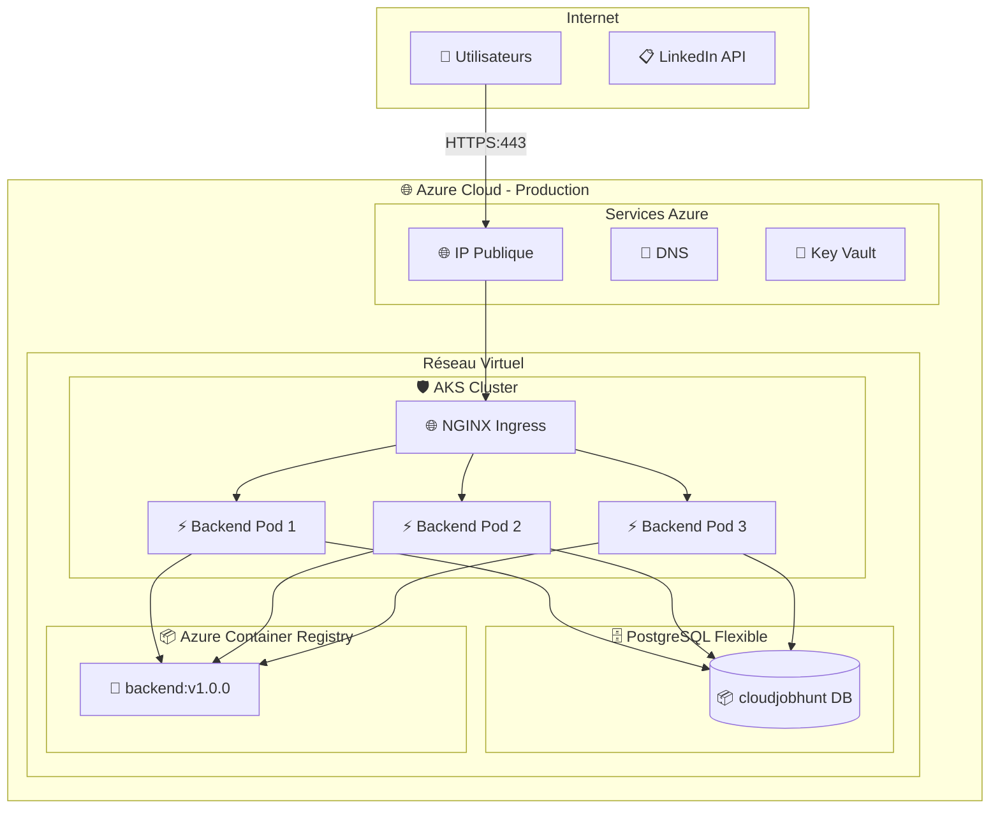
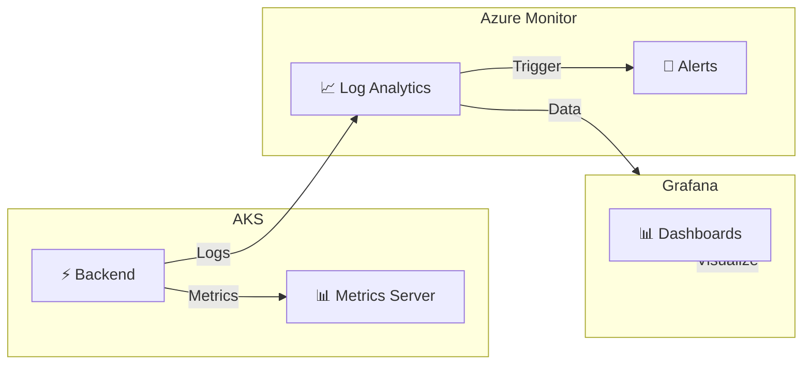

# CloudJobHunt - Plan de Déploiement Production

## 📋 Vue d'Ensemble

Ce document décrit le plan complet pour déployer CloudJobHunt en production sur Azure Kubernetes Service avec PostgreSQL Flexible Server.

### Objectifs
- Déployer l'application FastAPI sur AKS avec haute disponibilité
- Configurer PostgreSQL avec accès sécurisé
- Exposer l'API via IP publique avec HTTPS
- Implémenter CI/CD avec Jenkins
- Activer le monitoring complet

---

## 1. Architecture Cible



---

## 2. Inventaire des Ressources Existantes

### 2.1 Terraform (À Réutiliser)
| Module | Fichier | Statut |
|--------|---------|--------|
| Networking | [`terraform/modules/networking/`](../terraform/modules/networking/) | ✅ Prêt |
| AKS | [`terraform/modules/aks/`](../terraform/modules/aks/) | ✅ Prêt |
| ACR | [`terraform/modules/acr/`](../terraform/modules/acr/) | ✅ Prêt |
| Database | [`terraform/modules/database/`](../terraform/modules/database/) | ✅ Prêt |
| Monitoring | [`terraform/modules/monitoring/`](../terraform/modules/monitoring/) | ✅ Prêt |

### 2.2 Kubernetes
| Ressource | Fichier | Statut |
|-----------|---------|--------|
| Deployment | [`k8s/deployment.yaml`](../k8s/deployment.yaml) | ✅ Existant - À adapter |
| Service | [`k8s/service.yaml`](../k8s/service.yaml) | ✅ Existant - LoadBalancer |
| Ingress | [`k8s/ingress.yaml`](../k8s/ingress.yaml) | ✅ Existant - À configurer TLS |

### 2.3 Application
| Ressource | Fichier | Statut |
|-----------|---------|--------|
| FastAPI | [`app/main.py`](../app/main.py) | ✅ Prêt |
| Config | [`app/config.py`](../app/config.py) | ✅ À adapter prod |
| Dockerfile | [`Dockerfile`](../Dockerfile) | ✅ Prêt |

---

## 3. Actions de Déploiement

### Phase 1: Infrastructure Production

#### 3.1 Créer l'Environnement Prod Terraform
```bash
# Créer terraform/environments/prod/
# Copier depuis dev et adapter:
# - environment = "prod"
# - sku_name pour B2s (plus de ressources)
# - Haute disponibilité PostgreSQL
```

**Fichiers à créer:**
- [`terraform/environments/prod/main.tf`](terraform/environments/prod/main.tf)
- [`terraform/environments/prod/variables.tf`](terraform/environments/prod/variables.tf)
- [`terraform/environments/prod/outputs.tf`](terraform/environments/prod/outputs.tf)

#### 3.2 Déployer l'Infrastructure
```bash
cd terraform/environments/prod
terraform init
terraform plan
terraform apply
```

### Phase 2: Configuration Kubernetes

#### 3.3 Créer les Secrets PostgreSQL
```yaml
# k8s/prod/postgres-secrets.yaml
apiVersion: v1
kind: Secret
metadata:
  name: postgres-secrets
type: Opaque
stringData:
  host: "psql-cloudhunt-prod.postgres.database.azure.com"
  port: "5432"
  name: "cloudjobhunt"
  user: "psqladmin@psql-cloudhunt-prod"
  password: "XXX"
```

#### 3.4 Mettre à jour le Deployment Production
```yaml
# k8s/prod/deployment.yaml
spec:
  replicas: 3
  strategy:
    type: RollingUpdate
    rollingUpdate:
      maxSurge: 1
      maxUnavailable: 0
  resources:
    requests:
      memory: "256Mi"
      cpu: "200m"
    limits:
      memory: "512Mi"
      cpu: "1000m"
```

#### 3.5 Configurer Ingress avec TLS
```yaml
# k8s/prod/ingress.yaml
annotations:
  nginx.ingress.kubernetes.io/ssl-redirect: "true"
  cert-manager.io/cluster-issuer: "letsencrypt-prod"
spec:
  tls:
    - hosts:
        - api.cloudjobhunt.com
      secretName: cloudjobhunt-tls
```

### Phase 3: CI/CD

#### 3.6 Créer le Jenkinsfile Production
```groovy
// Jenkinsfile.prod
pipeline {
    agent any
    
    environment {
        ACR_NAME = 'cloudhuntdev'
        IMAGE_TAG = "backend:${BUILD_NUMBER}"
        ENV = 'prod'
    }
    
    stages {
        stage('Build') {
            steps {
                sh "docker build -t ${ACR_NAME}.azurecr.io/${IMAGE_TAG} ."
            }
        }
        
        stage('Push to ACR') {
            steps {
                sh "az acr login -n ${ACR_NAME}"
                sh "docker push ${ACR_NAME}.azurecr.io/${IMAGE_TAG}"
            }
        }
        
        stage('Deploy to AKS') {
            steps {
                sh "az aks get-credentials -g rg-cloudhunt-prod -n aks-cloudhunt-prod"
                sh "kubectl set image deployment/backend backend=${ACR_NAME}.azurecr.io/${IMAGE_TAG} -n cloudjobhunt"
            }
        }
    }
}
```

---

## 4. Plan de Monitoring



### 4.1 Métriques à Surveiller
- **CPU/Mémoire** des pods
- **Latence** des requêtes API
- **Taux d'erreur** (5xx, 4xx)
- **Nombre de requêtes** par seconde
- **Connexions DB** actives

### 4.2 Alerts
- CPU > 80% pendant 5 minutes
- Pod en CrashLoopBackOff
- Latence API > 500ms
- Taux d'erreur > 1%

---

## 5. Checklist de Déploiement

### Pré-Déploiement
- [ ] Terraform état vérifié (pas de dérive)
- [ ] Image Docker buildée et testée
- [ ] Secrets PostgreSQL créés
- [ ] Certificat TLS obtenu (Let's Encrypt)
- [ ] Backup PostgreSQL récent

### Déploiement
- [ ] Infrastructure prod déployée
- [ ] Secrets K8s appliqués
- [ ] Deployment avec nouvelles replicas
- [ ] Service LoadBalancer configuré
- [ ] Ingress avec TLS activé

### Post-Déploiement
- [ ] Health checkendpoint répond
- [ ] Logs accessibles
- [ ] Métriques dans Grafana
- [ ] Alertes configurées
- [ ] DNS pointant vers IP publique
- [ ] HTTPS fonctionne
- [ ] Tests de charge réussis

---

## 6. Rollback Plan

### Si le déploiement échoue:
```bash
# Revenir à la version précédente
kubectl rollout undo deployment/backend -n cloudjobhunt

# Ourollback complet
kubectl rollout undo deployment/backend -n cloudjobhunt --to-revision=PREVIOUS_REVISION
```

### En cas de problème critique:
```bash
# Restaurer depuis backup Terraform
cd terraform/environments/prod
terraform state pull
terraform apply -target=azurerm_postgresql_flexible_server.main
```

---

## 7. Prochaines Étapes

1. **Confirmer le déploiement de l'infrastructure prod**
2. **Obtenir les credentials Azure** (service principal ou utilisateur)
3. **Configurer le DNS** (cloudjobhunt.com ou sous-domaine)
4. **Valider le plan** avant exécution

---

*Document généré pour le déploiement CloudJobHunt Production*
*Date: 2026-02-01*
